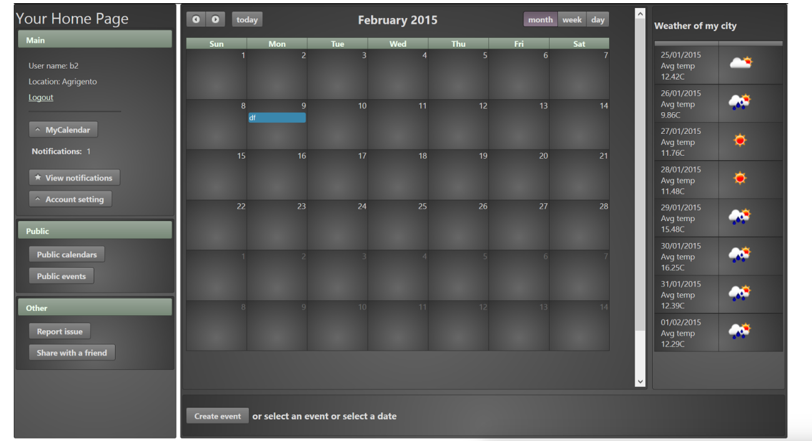

# Introduction #

The system that we are going to project and to implement is a weather based on online calendar. 

The purpose of the calendar is to make easy to handle events with the possibility to create, modify and delete them, during the creation is possible to send invitations to other registered user. 

The system can automatically provides weather forecast for every outside events and notifies it in time.

Furthermore it is possible to make a calendar or events public, so every one can see incoming events and if someone is busy or not.

### Screenshot sample ###

